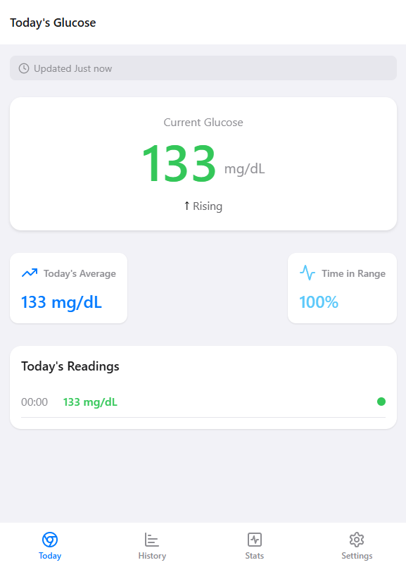
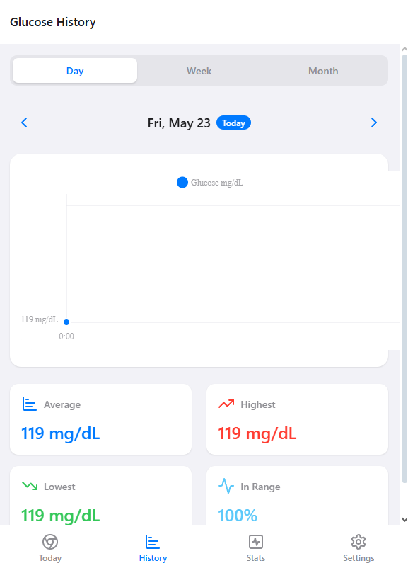
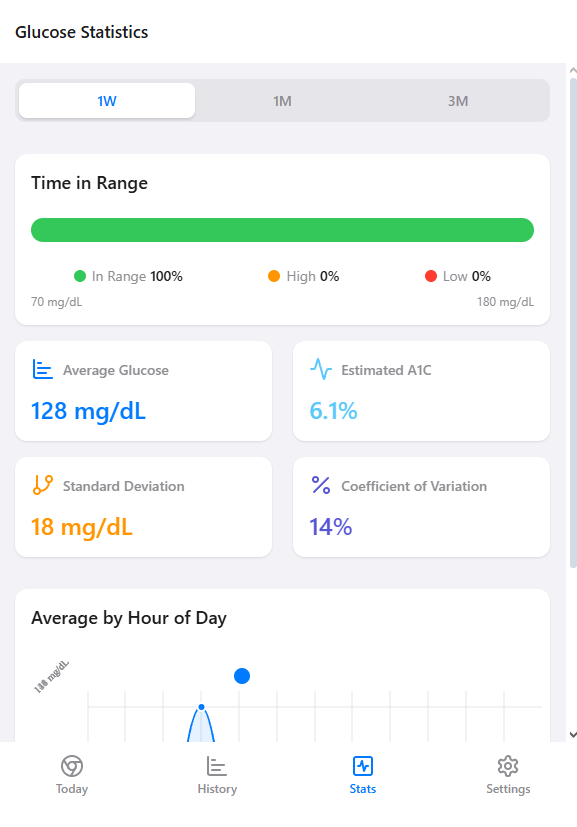
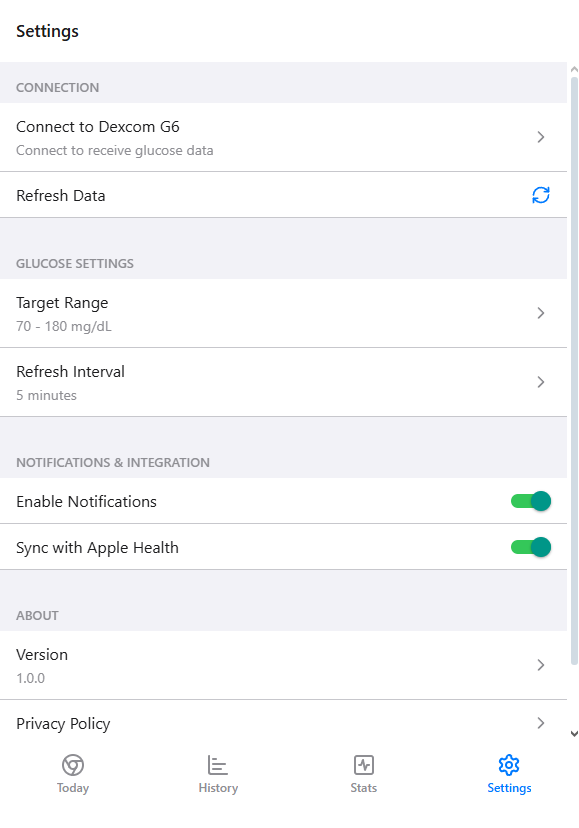

# Dexcom Connect

A beautiful and user-friendly mobile application that connects with your Dexcom G6 Continuous Glucose Monitor (CGM) to help you track and analyze your blood glucose levels.

## Features

- **Real-time Glucose Monitoring**: View your current glucose level with trend indicators
- **Historical Data**: Track your glucose patterns over time with detailed charts and graphs
- **Statistical Analysis**: Get insights into your glucose control with comprehensive statistics
- **Time in Range**: Monitor the percentage of time your glucose stays within target range
- **Apple Health Integration**: Sync your glucose data with Apple Health (iOS only)
- **Customizable Alerts**: Set personalized alerts for high and low glucose levels
- **Beautiful UI**: Clean, modern interface designed for easy reading and navigation

## Screenshots

<p align="center">
  
  
</p>
<p align="center">
  
  
</p>

## Getting Started

### Prerequisites

- Dexcom G6 CGM and mobile app
- iOS device (for Apple Health integration)

### Installation

1. Clone the repository:
```bash
git clone https://github.com/yourusername/dexcom-connect.git
```

2. Install dependencies:
```bash
cd dexcom-connect
npm install
```

3. Start the development server:
```bash
npm run dev
```

### Configuration

1. Create a `.env` file in the root directory:
```
EXPO_PUBLIC_API_URL=your_dexcom_api_url
EXPO_PUBLIC_API_KEY=your_api_key
```

2. Enable necessary permissions in your Dexcom app settings
3. For iOS users, grant Apple Health access when prompted

## Tech Stack

- React Native
- Expo
- Expo Router
- React Native Reanimated
- React Native Chart Kit
- Lucide Icons

## Contributing

1. Fork the repository
2. Create your feature branch (`git checkout -b feature/AmazingFeature`)
3. Commit your changes (`git commit -m 'Add some AmazingFeature'`)
4. Push to the branch (`git push origin feature/AmazingFeature`)
5. Open a Pull Request

## License

This project is licensed under the MIT License - see the [LICENSE](LICENSE) file for details.

## Acknowledgments

- Dexcom for their CGM technology
- The Expo team for their amazing framework
- The open-source community for their contributions

## Support

For support, please open an issue in the GitHub repository or contact support@dexcomconnect.com.

## Privacy

This application handles sensitive medical data. We take your privacy seriously and implement strict security measures. Please review our privacy policy for more information.
